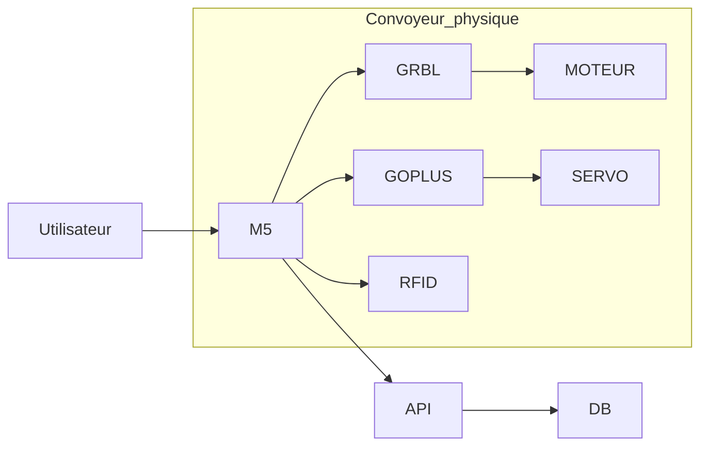

1. Objectif du projet

Le but est de créer un convoyeur autonome capable de :
Piloter un moteur Nema17 (via module GRBL)
Piloter un servo SG90 (via GoPlus2)
Lire un badge RFID I2C pour identifier des objets
Communiquer en Wi-Fi avec Dolibarr, récupérer des produits, envoyer des informations
Afficher les informations sur l’écran du M5Stack
Le projet inclut firmware, électronique et intégration API.


# README — Installation & Configuration du Projet Convoyeur (Dolibarr + M5Stack)

Ce document explique comment installer et configurer l’environnement nécessaire pour faire fonctionner le **M5Stack** avec l’API REST de **Dolibarr**, via Docker.  
Il couvre aussi la configuration réseau afin de permettre la communication ESP32 → API → Base de données.

---

## 1. Prérequis

### Logiciels nécessaires
- **Docker Desktop** installé  
- **PlatformIO** (VSCode avec extension PlatformIO)
- **Driver USB CP210x** (pour que Windows reconnaisse le M5Stack)

### Matériel
- M5Stack (Fire / Core2 / Basic)
- Câble USB Type-C fonctionnel
- Connexion Wi-Fi en **2,4 GHz**
- Smartphone (optionnel mais recommandé pour créer un hotspot Wi-Fi)

---

## 2. Installation de Dolibarr via Docker

Dans le dossier du projet, exécuter :

```bash
docker compose up -d
```

Cela démarre automatiquement :
- un **serveur MariaDB**
- un **Dolibarr** opérationnel
- un **phpMyAdmin** pour visualiser la base

### URLs par défaut :
| Service | URL |
|--------|------|
| Dolibarr | http://localhost:8080 |
| phpMyAdmin | http://localhost:8081 |

### Identifiants par défaut :
- Dolibarr : `admin / admin`  
- phpMyAdmin : `root / root`

⚠️ Pense à activer dans Dolibarr :
- **Module Produits**
- **Module Entreposage / Stocks**
- **Module API REST**
- **Clé API utilisateur**

---

## 3. Configuration de l’API Dolibarr

Dans Dolibarr :

### Activer l'API REST :
Menu → **Configuration → Modules → API REST**  
→ Activer

### Générer la clé API :
Menu → **Utilisateurs & Groupes → admin → Onglet API**  
→ Copier la valeur de : `DOLAPIKEY`

Tu en auras besoin dans le code du M5Stack :

```cpp
const char* DOLAPIKEY = "TA_CLE_API_ICI";
```

---

## 4. Configuration réseau (IMPORTANT)

Le M5Stack doit être sur **le même réseau que ton PC**.  
Deux options :

---

### OPTION 1 — Hotspot du téléphone (recommandé)

1. Activer le partage Wi-Fi sur le smartphone  
2. SSID conseillé : `M5_TEST`  
3. Mot de passe simple : `12345678`  
4. Connecter **le PC et le M5Stack** à ce réseau  
5. Trouver l’adresse IP du PC :

```cmd
ipconfig
```

---

### OPTION 2 — Réseau local simple (box internet)

⚠️ Ne fonctionne pas dans la plupart des écoles :  
les réseaux type IONIS utilisent WPA2-Enterprise et l’ESP32 ne peut pas s’y connecter.

---

## 5. Installation du driver USB CP210x (Windows)

Si le M5Stack n’apparaît pas sur COM :

1. Télécharger le driver officiel :  
   https://www.silabs.com/documents/public/software/CP210x_Universal_Windows_Driver.zip

2. Extraire le zip  
3. Dans le **Gestionnaire de périphériques** :
   - Clic droit → *Mettre à jour le pilote*
   - Choisir *Rechercher un pilote sur mon ordinateur*
   - Sélectionner le dossier téléchargé

Le M5 doit maintenant apparaître comme :

```
CP210x USB to UART Bridge (COM3)
```

---

## 6. Upload du firmware dans le M5Stack

Via PlatformIO :

```
CTRL + ALT + U  (Upload)
CTRL + ALT + M  (Monitor série)
```

## 7. Schéma d’architecture du système


